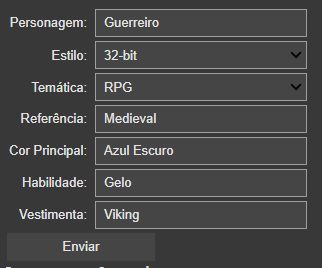
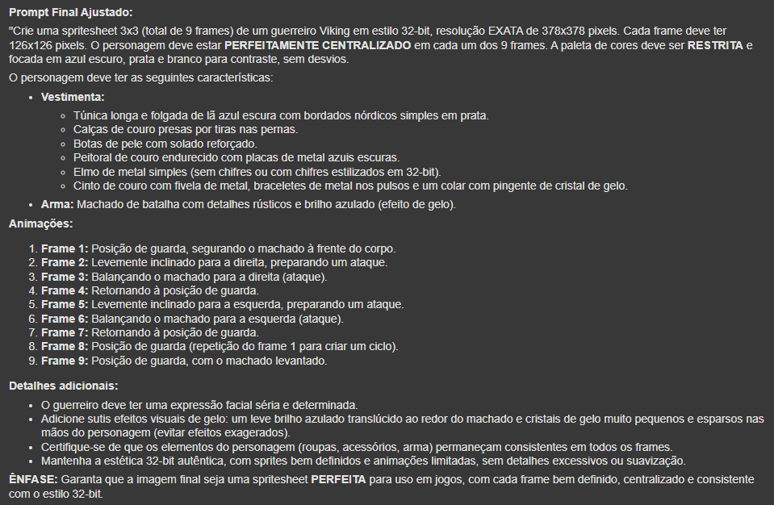
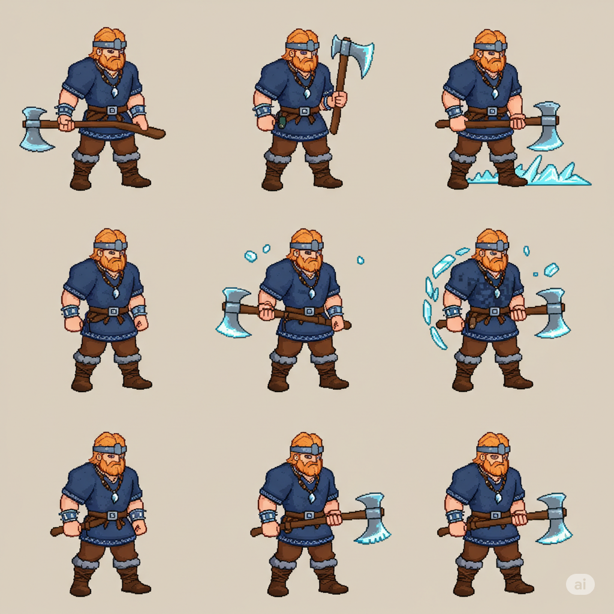
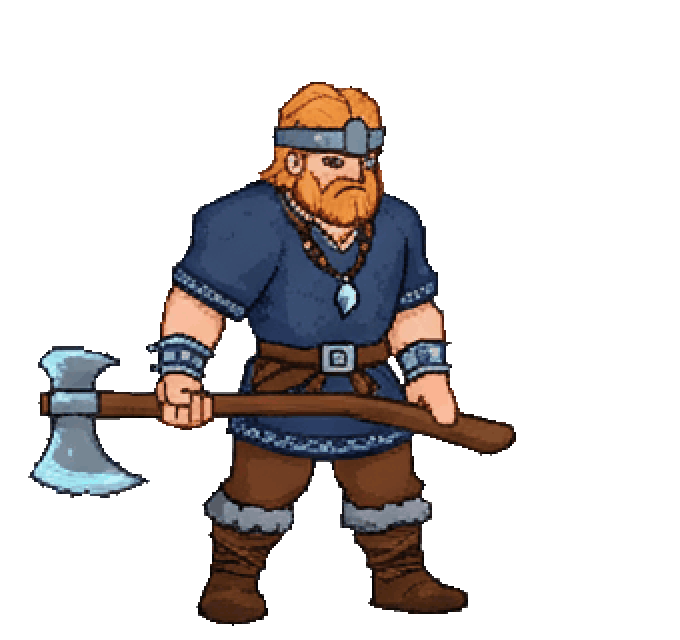
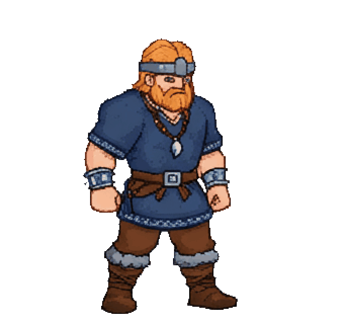
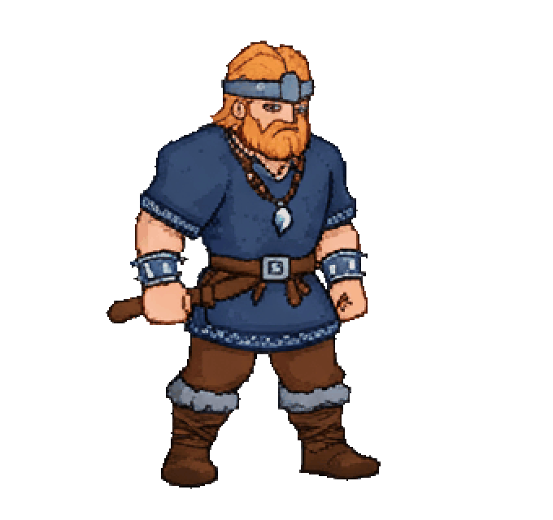

## 👾✨ Gerador de Sprites 2D com IA - Projeto Alura (Estilo Retro) ✨👾

Um projeto incrível desenvolvido para a Imersão de IA da Alura para a criação de sprites 2D para jogos utilizando a inteligência artificial! Este projeto inovador emprega uma arquitetura com **três agentes de IA** especializados para otimizar o processo de geração de sprites de alta qualidade e consistentes.

### ⚠️ GRANDE AVISO IMPORTANTE ⚠️

**Utilize a geração de imagens apenas para protótipos e geração de conceitos. A IA não substitui a arte humana! Assim que estiver satisfeito com o resultado, utilize-o como referência para a criação da versão final por um artista.**

  
  
  
   
  
  
  

## 🚀 Como Usar 🚀

1.  **Abra o Google Colab:**
    * Clique no botão abaixo para abrir o notebook diretamente no Colab:

      *(Faça uma cópia para editar caso seja necessário)*

2.  **Faça login** com sua conta Google. 🔑
3.  **Certifique-se** sua chave Gemini está ativada e seu colab está integrado com o Gemini. ⚠️
4.  **Execute as células** do notebook na ordem. ➡️
5.  **Preencha o formulário interativo:** 📝
    * **Personagem:** 🧑‍🌾, 🧙, 👽 (Nome ou tipo)
    * **Estilo:** 🎨 (8-bit, 16-bit, 32-bit, 64-bit)
    * **Temática:** 🎭 (RPG, Fantasia, Aventura, etc.)
    * **Referência:** 🕰️ (Medieval, Cyberpunk, etc.)
    * **Cor Principal:** 🌈
    * **Habilidade:** ✨ (Gelo, Fogo, etc.)
    * **Vestimenta:** 👕,  armor
6.  Clique no botão "Enviar". 📤
7.  **Copie o prompt final** gerado na saída. ✂️
8.  Use o prompt em uma ferramenta de geração de imagens de IA (Stable Diffusion, Midjourney, Gemini, GPT etc.) para criar a spritesheet! 🖼️

### 🤖 Nossos Agentes Inteligentes:

* **✍️ Descritor (The Detail Alchemist):** Este agente é o mestre da descrição! Com base nas informações fornecidas sobre o personagem, como:
    * **Personagem:** (Ex: Cavaleiro, Mago, Alienígena)
    * **Estilo:** (Ex: 8, 16, 32 ou 64 bits!)
    * **Temática:** (Ex: Medieval, Fantasia, Sci-fi)
    * **Referência:** (Ex: Link para uma imagem, descrição de um personagem existente)
    * **Cor:** (Ex: Paleta de cores primárias, tons pastéis)
    * **Habilidade:** (Ex: Atacando com espada, lançando magia, correndo)
    * **Vestimenta:** (Ex: Armadura de prata, manto roxo, uniforme espacial)
    O **Descritor** elabora uma descrição textual rica e detalhada, capturando a essência do sprite desejado para guiar os próximos agentes.

* **🎨 Gerador (The Prompt Weaver):** Com a descrição detalhada fornecida pelo Descritor, este agente entra em ação como um verdadeiro tecelão de prompts! Seu foco é transformar essa descrição em um prompt de imagem otimizado para modelos de IA generativos. Ele aplica técnicas avançadas para garantir que o prompt seja claro, conciso e contenha os elementos-chave para a criação do sprite desejado.

* **🛠️ Ajustador (The Consistency Crafter):** O toque final para a perfeição! O **Ajustador** analisa o prompt gerado e aplica ajustes estratégicos para garantir a consistência visual do sprite. Ele se certifica de que elementos como proporção, estilo artístico e detalhes importantes estejam bem definidos no prompt, aumentando as chances de obter um resultado final coeso e de alta qualidade.+

### 🚀 Como Funciona:

1.  Você fornece as informações básicas do sprite desejado (personagem, estilo, temática, etc.).
2.  O **Descritor** usa essas informações para criar uma descrição textual detalhada.
3.  O **Gerador** transforma essa descrição em um prompt de imagem otimizado para IA.
4.  O **Ajustador** refina o prompt para garantir a consistência do sprite gerado.
5.  O prompt final pode ser utilizado em diversos modelos de IA de geração de imagens para criar seus sprites 2D!